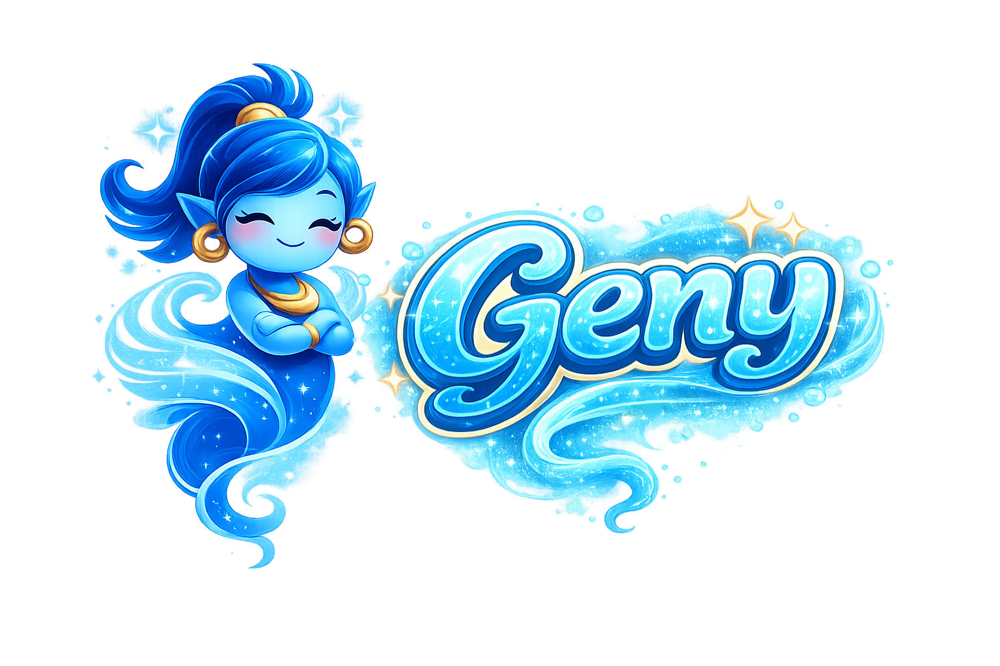

<p align="center">
  
</p>

<h1 align="center">Geny — <em>Geny Execute, Not You</em></h1>

<p align="center"><em>I'll handle it — you just sit back.</em></p>

<p align="center">
A multi-agent <strong>VTuber + autonomous worker</strong> platform. Pair a chatty Live2D / Spine VTuber with a tool-running Sub-Worker, watch them collaborate inside a 3D city, and swap any of five LLM backends with one config click.
</p>

<p align="center">
<a href="README_ko.md">한국어 README</a> ·
<a href="docs/architecture.md">Architecture</a> ·
<a href="docs/providers.md">LLM Providers</a> ·
<a href="docs/sessions.md">Sessions &amp; Delegation</a> ·
<a href="docs/environments.md">Environments</a> ·
<a href="docs/error_codes.md">Error Codes</a>
</p>

<p align="center">
  <a href="LICENSE"></a>
  <a href="https://github.com/CocoRoF/Geny/releases/latest"></a>
  <a href="https://pypi.org/project/geny-executor/"></a>
  
  
  <a href="https://github.com/CocoRoF/Geny/stargazers"></a>
</p>

```bash
# 60-second start — no GPU, no API key required
git clone https://github.com/CocoRoF/Geny.git && cd Geny && ./geny up
# → open http://localhost:3000
```

<p align="center"><sub>Details, profiles and manual setup → <a href="#installation">Installation</a></sub></p>

## The Geny ecosystem

These projects are built to work together. **Geny** is the product at the top of the stack; everything below is a building block you can also use on its own. **➡️ marks where you are.**

| Project | What it is | Role in the stack |
|---|---|---|
| ➡️ [**Geny**](https://github.com/CocoRoF/Geny) | Multi-agent VTuber + autonomous-worker platform | The product — uses every project below |
| [**geny-executor**](https://github.com/CocoRoF/geny-executor) | 21-stage, manifest-driven agent pipeline · PyPI · Apache-2.0 | The engine everything runs on |
| [**GAPT**](https://github.com/CocoRoF/geny-adapted-project-toolkit) | Self-hosted AI DevOps platform — sandbox · edit · build · deploy | Where agents safely touch real repos |
| [**geny-avatar**](https://github.com/CocoRoF/geny-avatar) | 2D live-avatar editor with AI texture generation | Where Geny's faces are made |
| [**edit2docs**](https://github.com/CocoRoF/edit2docs) | AI-agent-native DOCX / XLSX / PPTX engine · PyPI · Apache-2.0 | How agents generate, edit and preview office documents |
| [**AN-Web**](https://github.com/CocoRoF/an-web) | AI-native headless browser engine · PyPI | How agents read and search the web |

<details>
<summary>How they fit together</summary>

```
                  Geny — the product (uses everything below)
                    │
      ┌─────────────┼──────────────┐
 agent engine    avatars      sandbox + deploy
      │             │              │
      ▼             ▼              ▼
 geny-executor  geny-avatar      GAPT
  (the engine)  (avatar editor)  (AI DevOps platform)
      │
      ├── edit2docs  (documents: generate · edit · native preview)
      └── AN-Web     (web: browse · read · search)
```

</details>

---

<!-- 📸 IMAGE NEEDED: hero screenshot — the 3D city playground with agents walking + the VTuber chat panel and Live2D avatar overlaid -->
> 📸 **Image needed** — _hero screenshot: the 3D city playground with agents walking, the VTuber chat panel, and the Live2D avatar._

---

## Desktop connector download

A **VTuber connector** that floats at the bottom of your desktop — leave the server running, and a live avatar lives at the bottom of your screen.

<!-- 📸 IMAGE NEEDED: the desktop connector — the floating avatar sitting at the bottom of a real desktop, tray menu open -->
> 📸 **Image needed** — _the desktop connector: the floating avatar at the bottom of a real desktop, tray menu open._

### 1) Installer — **[➡️ Get it from the latest Release](https://github.com/CocoRoF/Geny/releases/latest)**

| OS | File | Install / first launch |
|---|---|---|
| **Windows** | `Geny-Setup-*.exe` | Double-click → on the SmartScreen warning, **More info → Run anyway** (currently unsigned) |
| **macOS** | `Geny-*.dmg` | Open and drag to Applications → first launch: **right-click → Open** (Gatekeeper) |
| **Linux** | `Geny-*.AppImage` / `*.deb` | AppImage: `chmod +x Geny-*.AppImage && ./Geny-*.AppImage` · deb: `sudo dpkg -i Geny-*.deb` |

> No installer listed yet? The release is still building — this is a public repo, so GitHub Actions auto-builds the macOS / Windows / Linux installers.

### 2) After launch — **just three fields and you're in**

1. **Geny server address** — prefilled with `https://geny-x.hrletsgo.me` (or your own host if you self-host).
2. **admin ID**
3. **admin password**

→ **Log in** and the token is saved to your OS keychain; the avatar appears at the bottom of the screen, ready to use. (Drag the avatar to move it; the tray icon opens settings / updates / quit.)

### Auto-update

From v0.3.0 the connector **updates itself via GitHub Releases** — it detects a new release while running, downloads it, and applies it on restart (you can also check manually via tray → *Check for updates*). Windows · Linux (AppImage) work unsigned; macOS auto-update turns on once the app is code-signed. *Install manually once, and every version after that is automatic.*

### Build from source

```bash
git clone https://github.com/CocoRoF/Geny.git
cd Geny/desktop
npm install
npm run dev          # dev run
npm run dist:win     # / dist:mac / dist:linux — build the installer yourself
```

More: [`desktop/README.md`](desktop/README.md) · design: [`dev_docs/vtuber-desktop/PLAN.md`](dev_docs/vtuber-desktop/PLAN.md)

---

## What Geny is


| Concept | What it does |
|---|---|
| **VTuber session** | The conversational face. Live2D / Spine avatar, persona prompt, TTS, emotion tags. Talks to the user; delegates real work to a paired Sub-Worker. |
| **Sub-Worker session** | The execution layer. Tool-using agent — file ops, shell, web fetch, MCP-bridged host tools. Reports results back through structured `[SUB_WORKER_RESULT]` messages. |
| **Environment** | A serialisable [`EnvironmentManifest`](docs/environments.md) that pins every pipeline stage + provider + tool set. One artifact, deterministic reproduction. |
| **3D City Playground** | Three.js / React Three Fiber dashboard — agents appear as characters walking a procedural city. |
| **Five LLM backends** | `anthropic` / `openai` / `google` / `vllm` (self-host) / `claude_code_cli` — switch per env, no code change. |
| **Stable error codes** | Every executor failure surfaces with a stable `exec.<component>.<reason>` code. The frontend renders localised, actionable Korean / English prompts. |

The backend is built on [`geny-executor`](https://github.com/CocoRoF/geny-executor) — a 21-stage manifest-driven agent pipeline (no LangChain, no LangGraph). The frontend is Next.js 16 with R3F-powered 3D, Pixi.js for whiteboard / 2D overlays, and a Korean/English i18n layer.

---

## Architecture (high level)

<!-- 📸 IMAGE NEEDED: a polished architecture diagram to replace / accompany the ASCII map below -->

```
┌────────────────────────── Geny ──────────────────────────────────┐
│                                                                  │
│  Frontend (Next.js 16 + R3F + Pixi)                              │
│   ├── 3D City Playground (Three.js / R3F)                        │
│   ├── VTuber chat panel + Live2D / Spine avatar                  │
│   ├── Environment editor (21-stage manifest UI)                  │
│   ├── LLM Backends settings (5 provider cards)                   │
│   ├── Memory / Knowledge / Whiteboard tabs                       │
│   └── Logs tab (i18n'd error codes, tool traces, stage events)   │
│                                                                  │
│  Backend (FastAPI)                                               │
│   ├── controller/  ← FastAPI routes (sessions, env, vtuber, …)   │
│   ├── service/                                                   │
│   │   ├── executor/    ← geny-executor hookup                    │
│   │   ├── gapt/        ← GAPT client + workspace provider        │
│   │   ├── environment/ ← manifest store + templates              │
│   │   ├── llm_patches/ ← Korean error envelopes + CLI tool tap   │
│   │   ├── memory/      ← session memory v2 + vector retrieval    │
│   │   ├── permission/  ← per-tool ACL evaluator                  │
│   │   ├── vtuber/      ← Live2D / Spine library + thinking-trig  │
│   │   └── chat/        ← chat-room store + delegation routing    │
│   ├── tools/  ← auto-loaded Python tools (send DM, memory, …)    │
│   ├── mcp/    ← auto-loaded MCP server configs                   │
│   ├── scripts/geny_mcp_bridge.py ← per-session MCP wrap for CLI  │
│   └── prompts/  ← role markdown (vtuber.md, worker.md, …)        │
│                                                                  │
│  geny-executor ≥2.47  (PyPI dep)                                 │
│   ├── 21-stage agent pipeline                                    │
│   ├── 5 LLM client implementations                               │
│   ├── ContainerCLIRunner + SandboxHandle (run CLI in a sandbox) │
│   └── ExecutorErrorCode taxonomy                                 │
│                                                                  │
│  gapt/  ← GAPT submodule (sandbox/devops platform)               │
│   ├── server/  FastAPI control plane (projects/workspaces/…)     │
│   ├── per-workspace containers (git · fs · terminal · preview)  │
│   └── deploy pipeline (compose / ssh / webhook targets)          │
└──────────────────────────────────────────────────────────────────┘
```

Full architecture writeup → [`docs/architecture.md`](docs/architecture.md).
Geny ⇄ GAPT integration → [`docs/analysis/gapt-integration-plan.md`](docs/analysis/gapt-integration-plan.md).

---

## Key features

### VTuber ↔ Sub-Worker pairing
Every VTuber session is auto-paired with a Sub-Worker. The VTuber handles conversation and personality; the Sub-Worker does real work. Delegation flows through a single MCP-bridged tool (`mcp__geny__send_direct_message_internal`) — see [`docs/sessions.md`](docs/sessions.md).

### Five LLM backends, one selector
Settings → LLM Backends gives each of the 5 providers (Anthropic / OpenAI / Google / vLLM / Claude Code CLI) its own card with health probe + auth flow. Stage 6 of any environment picks one via dropdown — see [`docs/providers.md`](docs/providers.md).

<!-- 📸 IMAGE NEEDED: Settings → LLM Backends — the five provider cards with health status -->
> 📸 **Image needed** — _Settings → LLM Backends: the five provider cards with their health status._

### Manifest-driven environments
Pipelines are defined as `EnvironmentManifest` JSON artifacts — 21 stages, one strategy per slot, version-controlled. The Environment editor in the UI lets you customise any preset (worker / VTuber / Sub-Worker) without touching code — see [`docs/environments.md`](docs/environments.md).

<!-- 📸 IMAGE NEEDED: the Environment editor — the 21-stage manifest UI with strategy dropdowns -->
> 📸 **Image needed** — _the Environment editor: the 21-stage manifest UI with strategy dropdowns._

### Per-session MCP wrap (Claude Code CLI)
When a session pins `claude_code_cli` as its Stage 6 backend, Geny attaches a per-session MCP bridge so the spawned CLI's LLM sees **Geny's tool registry** as `mcp__geny__<tool>` — file ops, web fetch, memory, blog publisher, sub-worker delegation — all callable natively inside the CLI's agentic loop.

### Stable error codes + i18n
Every executor exception carries a stable `exec.<component>.<reason>` code. The session log renders the matching Korean (or English) message + recommended next step instead of the raw English server error — see [`docs/error_codes.md`](docs/error_codes.md).

### 3D city playground
Active sessions appear as walking characters in a procedural Kenney-asset city. A* pathfinding, bone-animated avatars, time-of-day cycle. R3F + Drei + Three.js.

<!-- 📸 IMAGE NEEDED: the 3D city playground — agents walking the procedural city, time-of-day lighting -->
> 📸 **Image needed** — _the 3D city playground: agents walking the procedural city under time-of-day lighting._

### Live2D + Spine + AI-baked avatars
Geny ships with a separate puppet-editor service ([`geny-avatar`](https://github.com/CocoRoF/geny-avatar)) wired in as a git submodule. Upload a Spine or Cubism puppet, decompose layers, paint masks, regenerate textures with AI, and bake the model straight into Geny's VTuber library.

### TTS / STT / voice notes
edge-tts for output, Whisper for input, OmniVoice integration for multi-speaker scenes. The voice-notes feature lets users dictate into the whiteboard.

### Knowledge whiteboard + memory v2
Session memory is routed through `geny-executor`'s Stage 2 (Context) + Stage 18 (Memory) — progressive disclosure, vault map, vector retrieval. The Knowledge whiteboard exposes a collaborative Pixi.js canvas for diagram-style sessions.

### Multi-pod ready
Redis-backed session metadata sharding lets multiple backend pods serve one user — useful for cloud deployments.

### Sandboxed projects & deploy (GAPT)
Project / workspace / sandbox / deploy is delegated to **[GAPT](https://github.com/CocoRoF/geny-adapted-project-toolkit)** (`geny-adapted-project-toolkit`), wired in as a **git submodule** at [`gapt/`](gapt/) (tracks `main`; `git pull` auto-rolls it via [`.githooks/post-merge`](.githooks/post-merge)). GAPT runs each workspace in its own isolated container (git · file ops · terminal · dev-server preview · compose/ssh deploy targets), Postgres-backed and Caddy-routed. Geny keeps its own agent runtime (persona · voice · emotion · memory) and points sessions at a GAPT workspace via the executor's `ContainerCLIRunner` — so the agent edits code inside the sandbox while Geny's moat stays host-side. Agents can also drive GAPT directly through its 41-tool MCP. Design: [`docs/analysis/gapt-integration-plan.md`](docs/analysis/gapt-integration-plan.md) · Deploy + test: [`docs/operations/gapt-test-guide.md`](docs/operations/gapt-test-guide.md).

---

## Project structure

```
geny/
├── README.md / README_ko.md          # this hub
├── img/                              # logos and screenshots
├── docs/                             # topic-page docs (architecture, sessions, …)
├── backend/                          # FastAPI + geny-executor host
│   ├── main.py                       # app entry + executor wiring
│   ├── pyproject.toml                # pins geny-executor >= 2.47.0
│   ├── controller/                   # FastAPI routes
│   │   ├── agent_controller.py       # session + stream + invoke
│   │   ├── llm_backends_controller.py# 5-provider health + auth
│   │   ├── mcp_bridge_controller.py  # per-session MCP RPC
│   │   ├── vtuber_*.py               # VTuber library + chat + thinking
│   │   ├── memory_*.py               # memory + knowledge + opsidian
│   │   ├── chat_controller.py        # chat-room CRUD
│   │   ├── environment_controller.py # manifest editor backend
│   │   └── …                         # cron, whiteboard, voice-notes, ...
│   ├── service/
│   │   ├── executor/                 # AgentSessionManager + AgentSession
│   │   ├── environment/              # manifest store + templates
│   │   ├── llm_patches.py            # Korean error envelopes + CLI tool tap
│   │   ├── memory/                   # session memory v2
│   │   ├── permission/               # per-tool ACL
│   │   ├── vtuber/                   # Live2D / Spine library + triggers
│   │   ├── chat/                     # chat-room store + delegation routing
│   │   ├── config/                   # ConfigManager + settings cards
│   │   ├── logging/                  # SessionLogger (now with error_code)
│   │   └── …
│   ├── tools/                        # auto-loaded Python tools
│   │   ├── built_in/                 # ships: messaging, memory, knowledge
│   │   └── custom/                   # web_search, browser, whiteboard, blog
│   ├── mcp/                          # auto-loaded MCP server configs
│   ├── scripts/geny_mcp_bridge.py    # stdio bridge for CLI MCP wrap
│   └── prompts/                      # role markdown (vtuber.md, worker.md, …)
├── frontend/                         # Next.js 16 + R3F + Pixi
│   └── src/
│       ├── components/               # tabs, modals, panels, env_management/…
│       ├── lib/                      # api.ts, i18n/, modelCatalog.ts, …
│       ├── store/                    # Zustand stores
│       └── types/                    # shared TypeScript types
├── vendor/geny-avatar/               # puppet-editor submodule
├── gapt/                             # GAPT git submodule (tracks main)
│   ├── server/                       # FastAPI control plane (projects/workspaces/…)
│   ├── compose/                      # GAPT compose stacks (postgres/redis/caddy/…)
│   ├── docker/workspace/             # per-workspace sandbox image
│   └── mcp/                          # 41-tool agent MCP for GAPT
└── docker-compose.{yml,dev,prod}.yml # compose stacks
```

For the developer-facing internal architecture maps see [`backend/docs/`](backend/docs/) and [`docs/architecture.md`](docs/architecture.md).

---

## Tech stack

| Layer | Technology |
|---|---|
| **Frontend** | Next.js 16, React 19, TypeScript, Tailwind CSS v4, Zustand 5, Pixi.js |
| **3D engine** | Three.js, React Three Fiber, Drei |
| **Avatars** | Live2D Cubism, Spine 4, [geny-avatar](https://github.com/CocoRoF/geny-avatar) editor |
| **Backend** | Python 3.11+, FastAPI, Uvicorn |
| **Agent pipeline** | [`geny-executor`](https://github.com/CocoRoF/geny-executor) (21 stages, 5 providers) |
| **LLM SDKs** | `anthropic`, `openai`, `google-genai` + vLLM (OpenAI-compatible) + Claude Code CLI subprocess |
| **MCP** | host-attached servers + per-session CLI MCP wrap |
| **TTS / STT** | edge-tts (output), Whisper (input), OmniVoice (multi-speaker) |
| **Persistence** | PostgreSQL (sessions, memory, knowledge), Redis (multi-pod metadata, optional) |
| **Container** | Docker Compose (dev / prod profiles + named volumes for OAuth credential survival) |

---

## Installation

### One-command (recommended) — `./geny up`

The lite path: up and running with no GPU, no API key, no git submodule.

```bash
git clone https://github.com/CocoRoF/Geny.git
cd Geny
./geny up            # postgres + backend + frontend (GPU-free, keyless)
```

`./geny up` handles it: checks docker/compose → seeds `.env` (from sample if
missing) → builds + starts → waits for backend health → prints the URL. Open
**http://localhost:3000** → create the admin account → **Settings → LLM
Backends**:

- **Local & keyless**: start Ollama, then *Discover models* on the Ollama card.
- **Cloud**: paste an Anthropic / OpenAI / Google key into its card.

Other commands:

```bash
./geny up --full     # + avatar-editor (git submodule) + local GPU TTS/STT (NVIDIA)
./geny doctor        # diagnose the host setup ( --fix to seed .env / init submodules )
./geny logs backend  # follow logs
./geny update        # git pull + rebuild + restart
./geny down          # stop
```

> The lite stack uses cloud edge-tts for voice. Self-hosted high-quality voice
> (OmniVoice) + STT (Whisper) turn on with `./geny up --full` when an NVIDIA GPU
> is present.

### Docker (manual)

```bash
# 1. Clone with submodules (gapt + geny-avatar + geny-licensed-assets)
git clone --recurse-submodules https://github.com/CocoRoF/Geny.git
cd Geny
# Already cloned without --recurse-submodules? Pull them in:
#   git submodule update --init --recursive
# Auto-roll the main-tracking submodules (gapt, geny-avatar) on every pull:
#   git config core.hooksPath .githooks   # one-time; runs `submodule update --remote`
# Update GAPT to the latest upstream main on demand:
#   git submodule update --remote gapt && git add gapt && git commit -m "chore: bump gapt"

# 2. Configure
cp backend/.env.example backend/.env
# Edit backend/.env — at minimum set ANTHROPIC_API_KEY (or use OAuth via Settings)

# 3. Run
docker compose up --build
```

Open **http://localhost:3000**.

Compose profiles:

| File | Use |
|---|---|
| `docker-compose.yml` | Default dev stack |
| `docker-compose.dev.yml` / `dev-core.yml` | Dev with hot-reload bind mounts |
| `docker-compose.prod.yml` / `prod-core.yml` | Production behind nginx |

Custom ports + data dirs documented in [`docs/architecture.md`](docs/architecture.md).

### Manual setup

For non-Docker development see the expandable section in [`docs/architecture.md`](docs/architecture.md). Minimum requirements: Python 3.11+, Node.js 18+, Claude Code CLI (`npm i -g @anthropic-ai/claude-code`), and at least one provider's credentials.

**Document editing / preview needs no extra system packages.** Agents edit office files a user uploads (pptx / docx / xlsx) and show live previews in the session's Canvas tab through [edit2docs](https://github.com/CocoRoF/edit2docs)' native OOXML render pipeline (geny-executor ≥2.44) — LibreOffice and poppler are no longer required and are gone from the Docker images (~500 MB lighter). Korean documents render correctly out of the box (bundled Noto CJK handling).

---

## Avatar Editor (geny-avatar)

Geny ships with a Next.js puppet-editor service ([`geny-avatar`](https://github.com/CocoRoF/geny-avatar)) wired in as a git submodule under `vendor/geny-avatar`. Upload a Spine or Cubism puppet, decompose layers, paint masks, regenerate textures with AI (gpt-image-2 / SAM), and bake the model directly into Geny's VTuber library (it appears with the `(Editor)` suffix).

`vendor/geny-avatar` tracks `main` via a versioned `post-merge` hook ([`.githooks/post-merge`](.githooks/post-merge)) — the server fast-forwards the submodule on every `git pull` without a pointer-bump dance.

```bash
git config core.hooksPath .githooks       # one-time per clone
git pull                                  # fast-forwards vendor/geny-avatar
docker compose -f docker-compose.prod.yml --profile tts-local up -d --build avatar-editor backend
```

Detailed integration → [`docs/_archive/`](docs/_archive/) (geny-avatar integration sprints).

---

## Environment variables

Configure in `backend/.env`:

| Variable | Description | Default |
|---|---|---|
| `APP_HOST` | Server bind address | `0.0.0.0` |
| `APP_PORT` | Server port | `8000` |
| `DEBUG_MODE` | Verbose logging | `false` |
| `ANTHROPIC_API_KEY` | Anthropic key (or use OAuth via Settings) | — |
| `OPENAI_API_KEY` | OpenAI key (or paste via Settings) | — |
| `GOOGLE_API_KEY` | Google GenAI key | — |
| `GITHUB_TOKEN` | GitHub PAT for PR automation | — |
| `USE_REDIS` | Enable Redis multi-pod metadata | `false` |
| `REDIS_HOST` / `REDIS_PORT` / `REDIS_PASSWORD` | Redis | `localhost` / `6379` / — |
| `GENY_AGENT_STORAGE_ROOT` | Session storage path | `/data/geny_agent_sessions` (Docker) |

The frontend's `API_URL` env (shell, build-time) overrides the backend target — see [`docs/architecture.md`](docs/architecture.md).

---

## Quick API tour

Geny exposes REST + SSE under `/api/`. The most commonly used:

```bash
# Create a VTuber session (auto-pairs a Sub-Worker)
curl -X POST http://localhost:8000/api/sessions \
  -H "Content-Type: application/json" \
  -d '{
    "session_name": "geny-1",
    "role": "vtuber",
    "env_id": "template-vtuber-env",
    "character_display_name": "Geny"
  }'

# List sessions
curl http://localhost:8000/api/sessions

# Send a chat message to the VTuber (auto-delegates to the Sub-Worker for complex tasks)
curl -X POST http://localhost:8000/api/chat/rooms/<room_id>/messages \
  -H "Content-Type: application/json" \
  -d '{"content": "Create test.txt and write a short self-introduction in it"}'

# Stream session logs (SSE)
curl -N http://localhost:8000/api/command/logs/<session_id>/stream
```

| Endpoint family | Purpose |
|---|---|
| `/api/sessions` | Session CRUD + status |
| `/api/agent/sessions/{id}/invoke` | One-shot invoke |
| `/api/command/logs/{id}/stream` | SSE log stream (carries error_code for i18n) |
| `/api/chat/rooms/*` | Chat-room store (VTuber ↔ user messaging) |
| `/api/environments` | Manifest CRUD + templates |
| `/api/llm-backends` | 5-provider health, auth, login flows |
| `/api/internal/mcp/{sid}/rpc` | Per-session MCP bridge (CLI wrap) |
| `/api/vtuber/library` | Live2D / Spine model registry |
| `/api/memory/*` | Session memory + knowledge whiteboard |

Full API reference → `/docs` (FastAPI auto-generated) when the backend is running.

---

## Tools & Skills

### DB-backed Custom Tools (UI-driven — recommended)

Register HTTP APIs as tools without writing Python — the **Environment Management → Custom Tools** tab:

| Backend kind | What it does |
|---|---|
| `http` | Make an HTTP request. `${arg:foo}` / `${secret:KEY}` / `${session:session_id}` placeholders in URL, headers, body |
| `mcp_proxy` | Re-expose an upstream MCP server's tool under a new name with an optional schema overlay |
| `builtin_alias` | Metadata overlay on an existing `backend/tools/custom/*_tools.py` Python tool — Geny ships the `blog_agent_*` family as samples this way |

Full guide → [`docs/custom_tools.md`](docs/custom_tools.md).

Stored as JSONB rows in the `custom_tools` table (model: [`backend/service/database/models/custom_tool.py`](backend/service/database/models/custom_tool.py)) and hot-reloaded into the live `ToolLoader` on every CRUD mutation — no process restart.

### Auto-loaded MCP servers

Drop a `.json` into `backend/mcp/` and it's available in every session that pulls it in via env manifest:

```jsonc
// backend/mcp/github.json
{
  "type": "http",
  "url": "https://api.github.com/mcp/",
  "description": "GitHub MCP server"
}
```

See [`backend/mcp/README.md`](backend/mcp/README.md).

### Auto-registered Python tools

Drop a `*_tools.py` into `backend/tools/custom/`:

```python
# backend/tools/custom/search_db_tools.py
from tools.base import tool

@tool
def search_database(query: str) -> str:
    """Search the database for records"""
    return f"Results for: {query}"

TOOLS = [search_database]
```

See [`backend/tools/README.md`](backend/tools/README.md). For richer ergonomics (description / schema editing / dry-run from the UI) prefer the **DB-backed custom tools** path above.

### Skills (SKILL.md)

Slash-command-style skills bundled with each session. Geny ships several tiers:

- `executor` — bundled inside `geny-executor` itself.
- `geny` — first-party Geny skills (`backend/skills/bundled/`).
- `sample` — Geny-shipped *templates* (`backend/skills/samples/`) you can copy into your own skills.
- `user` — operator-supplied under `~/.geny/skills/` (opt-in via `skills.user_skills_enabled`).

Manage via the **Environment Management → SKILLS** tab.

### Per-session MCP wrap (Claude Code CLI)

When a session's Stage 6 provider is `claude_code_cli`, Geny attaches its own tool registry to the spawned CLI's LLM via a stdio MCP bridge (`scripts/geny_mcp_bridge.py`). The CLI's LLM sees `send_direct_message_internal`, `memory_write`, `web_search`, etc. as `mcp__geny__<tool>` and calls them natively — see [`docs/sessions.md`](docs/sessions.md) for the full flow.

---

## Error handling + i18n

Every executor exception carries a stable [`ExecutorErrorCode`](https://github.com/CocoRoF/geny-executor/blob/main/docs/error_codes.md) like `exec.cli.auth_failed`. The backend threads it through `SessionLogger` onto the SSE payload; the frontend renders the localised message + actionable next step via an `executor.<code>` i18n lookup. Instead of the raw English server message, the end-user sees (Korean example):

> Claude Code CLI 인증이 만료됐어요. 설정 → LLM 백엔드 → Claude Code (CLI) 카드의 ‘다시 로그인’을 누르거나 `ANTHROPIC_API_KEY` 를 붙여넣어 주세요.

Detailed flow → [`docs/error_codes.md`](docs/error_codes.md).

---

## Cross-platform support

- **Windows**: `%LOCALAPPDATA%\geny_agent_sessions`, auto-detects `.cmd`/`.exe` executables.
- **macOS / Linux**: `/tmp/geny_agent_sessions` (host) → `/data/geny_agent_sessions` (container).

---

## Community

| Contributor | What | Link |
|---|---|---|
| <a href="https://github.com/SonAIengine"></a> [`graph-tool-call`](https://github.com/SonAIengine/graph-tool-call) | Inspiration for Tool-Search-Logic | — |

---

## Articles

How Geny came together — the harness, voice (TTS) inference and memory — from the author's blog ([hrletsgo.me](https://hrletsgo.me/en)).

| Article | Korean |
|---|---|
| [Building Geny-Harness: A Personal AI Assistant with Memory](https://hrletsgo.me/en/documents/building-geny-harness-ai-assistant-memory-agent) | [한국어](https://hrletsgo.me/documents/geny-harness-engineering-build-your-own-assistant) |
| [TTS Inference Deep Dive — Part 1: Adopting OmniVoice](https://hrletsgo.me/en/documents/tts-inference-omnivoice-integration) | [한국어](https://hrletsgo.me/documents/tts-inference-1-omnivoice-intro) |
| [Dissecting Streaming TTS Inference Bottlenecks](https://hrletsgo.me/en/documents/streaming-tts-inference-bottleneck-analysis) | [한국어](https://hrletsgo.me/documents/tts-inference-2-streaming-bottleneck) |
| [Harness Engineering: How to Give AI Agents Real Memory](https://hrletsgo.me/en/documents/ai-agent-memory-architecture-harness-engineering) | [한국어](https://hrletsgo.me/documents/harness-engineering-memory-architecture) |

## Related projects

Part of **the Geny ecosystem** — see [The Geny ecosystem](#the-geny-ecosystem) above:

- [**geny-executor**](https://github.com/CocoRoF/geny-executor) — the 21-stage agent pipeline Geny's backend runs on (Apache-2.0)
- [**GAPT**](https://github.com/CocoRoF/geny-adapted-project-toolkit) — the sandbox / DevOps platform Geny delegates projects & deploys to (submodule at `gapt/`)
- [**geny-avatar**](https://github.com/CocoRoF/geny-avatar) — the puppet editor that bakes avatars into Geny (submodule at `vendor/geny-avatar`)

---

## Contributing

Issues and pull requests are welcome — bug reports, docs, translations, avatars, tools and skills all count. The fastest way in:

1. `./geny up` (60-second local stack) → reproduce or build against it.
2. Check [`docs/`](docs/) for the architecture / sessions / environments guides.
3. Open an issue first for anything large; small fixes can go straight to a PR.

If Geny is useful to you, a ⭐ helps other people find it.

---

## License

[Apache License 2.0](LICENSE). Copyright 2026 CocoRoF — see [NOTICE](NOTICE).

---

## Versioning + history

| Date | Highlight |
|---|---|
| 2026-07-06 | Opsidian 3D knowledge graph rebuilt on [@cocorof/graphier](https://github.com/CocoRoF/graphier) — WebGL instancing, reheat-free filters, minimap |
| 2026-07-06 | Screen-observation vision pipeline fixed end-to-end (geny-executor 2.45 CLI vision wire) |
| 2026-07-05 | geny-executor 2.44 — LibreOffice-free document preview via edit2docs native render |
| 2026-07-04 | geny-executor 2.43 — Browser* / Doc* built-ins on AN-Web + edit2docs engines |
| 2026-07-03 | Deferred tool search — tool schemas load on demand instead of every-turn upfront |
| 2026-05-22 | Doc refresh — README EN/KO, docs/* topic pages |
| 2026-05-22 | Phase 2: executor error codes → frontend i18n (PR #830) |
| 2026-05-21 | geny-executor 2.1.0 — `ExecutorErrorCode` taxonomy + structured event payloads |
| 2026-05-20 | geny-executor 2.0.6 — copilot_cli removed + 4 compat patches upstreamed |
| 2026-05-19 | Phase I — claude_code_cli MCP wrap (per-session bridge + tool_use strip + observability tap) |
| 2026-04-29 | host_selections (env-scoped hooks / skills / permission picker) |

See the [GitHub commit history](https://github.com/CocoRoF/Geny/commits/main) for the full log.

---

> _Primary user mode is Korean — switch to English instantly with the ENG button._
