<p align="center">
  
</p>

<h1 align="center">Geny — <em>Geny Execute, Not You</em></h1>

<p align="center">
A self-hosted home for AI agents with a face, a voice and a memory —<br/>
agents that do the work, remember it, and speak up on their own.
</p>

<p align="center">
<a href="README_ko.md">한국어</a> ·
<a href="#quick-start">Quick start</a> ·
<a href="#a-tour-with-ellen">Tour</a> ·
<a href="#apps">Apps</a> ·
<a href="#install">Install</a> ·
<a href="docs/providers.md">Model accounts</a>
</p>

<p align="center">
  <a href="LICENSE"></a>
  <a href="https://github.com/CocoRoF/Geny/releases/latest"></a>
  <a href="https://pypi.org/project/geny-executor/"></a>
  
  
  <a href="https://github.com/CocoRoF/Geny/stargazers"></a>
</p>

<p align="center">
  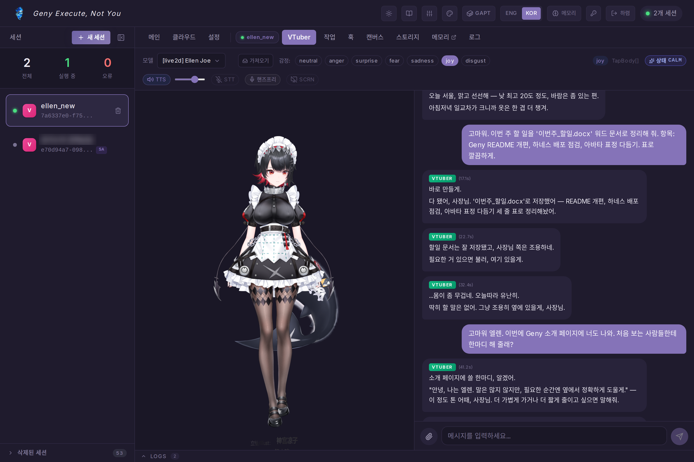
</p>
<p align="center"><sub>Ellen (<code>ellen_new</code>) on the web app. She looked up the weather, wrote a Word document, and introduced herself:<br/><em>"Hi, I'm Ellen. I don't say much, but when it matters I'll be right beside you and get it right."</em></sub></p>

---

## What Geny is

You run one Geny server. On it live your agents — each one a conversation that never ends, with its own persona, avatar, voice, memory and workspace. They don't just answer: they call tools, write files and office documents, search the web, run code in a sandbox, set up their own automations, and talk to you first when they have something to say.

You reach the same agent from three places — the **web app**, the **desktop app** (where the avatar lives on your screen), and your **phone** — and it is one conversation everywhere. Which model answers is up to you: sign in with a **Claude Code** or **ChatGPT (Codex)** subscription, paste an API key for any of 16 providers, or point it at your own **Ollama / vLLM** server, and switch mid-conversation.

Everything runs on [`geny-executor`](https://github.com/CocoRoF/geny-executor), a 21-stage agent pipeline published on PyPI. No LangChain, no LangGraph.

## Quick start

```bash
git clone https://github.com/CocoRoF/Geny.git && cd Geny && ./geny up
# → open http://localhost:3000, create the admin account,
#   then 설정 (Settings) › 모델 (Models) → add an account
```

No GPU and no API key are needed to start: a local Ollama works, and voice falls back to cloud edge-tts. Details → [Install](#install).

---

## A tour with Ellen

Every screen below is the real thing: Geny's production server, the agent `ellen_new`, and the conversation above — captured with Playwright (web, phone) and the desktop app's own screenshot harness. Account e-mails and the name of a second, private agent are blurred.

### She lives on your desktop

<p align="center">
  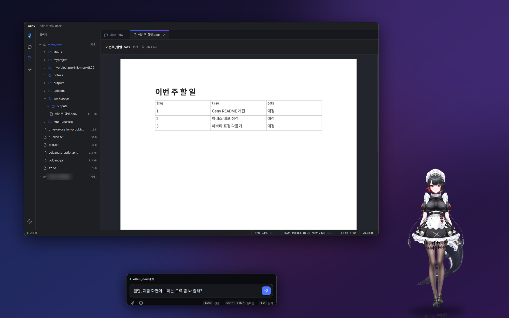
</p>
<p align="center"><sub>Composited from real captures of the desktop app's three windows — the avatar overlay, the quick-chat bar (<kbd>Ctrl/Cmd</kbd>+<kbd>Shift</kbd>+<kbd>Enter</kbd>) and the main window — laid on a wallpaper.</sub></p>

The **desktop app** puts the avatar on your screen — transparent, always on top, click-through except where you touch it. Talk to it from the quick-chat bar, by push-to-talk (<kbd>Ctrl/Cmd</kbd>+<kbd>Shift</kbd>+<kbd>Space</kbd>) or hands-free, show it your screen, and let it hear and speak through the devices you pick. Its main window is a workspace: every agent's files in one explorer, documents rendered in place, and the conversation beside them.

<table>
<tr>
<td width="50%">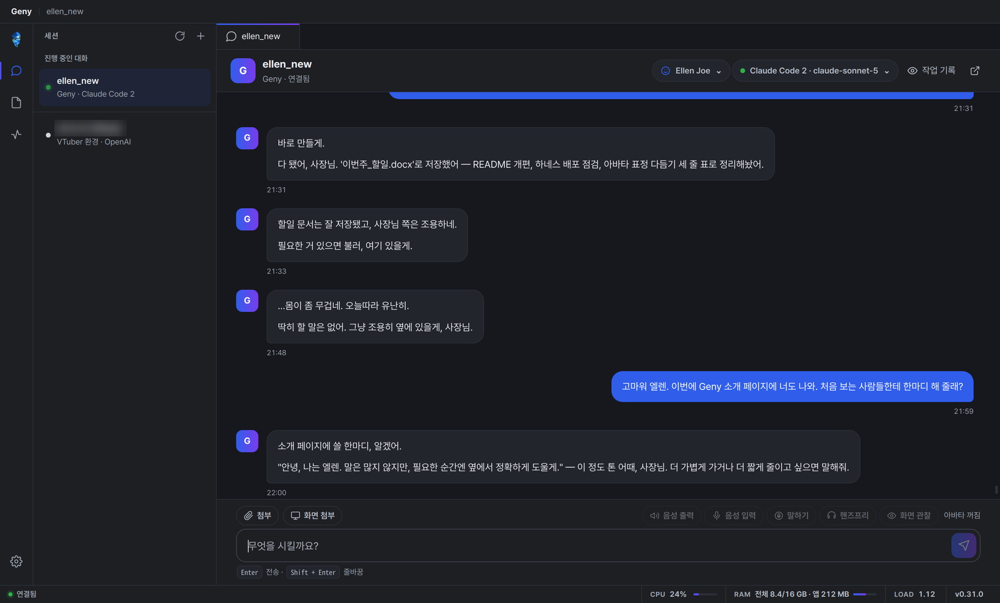</td>
<td width="50%">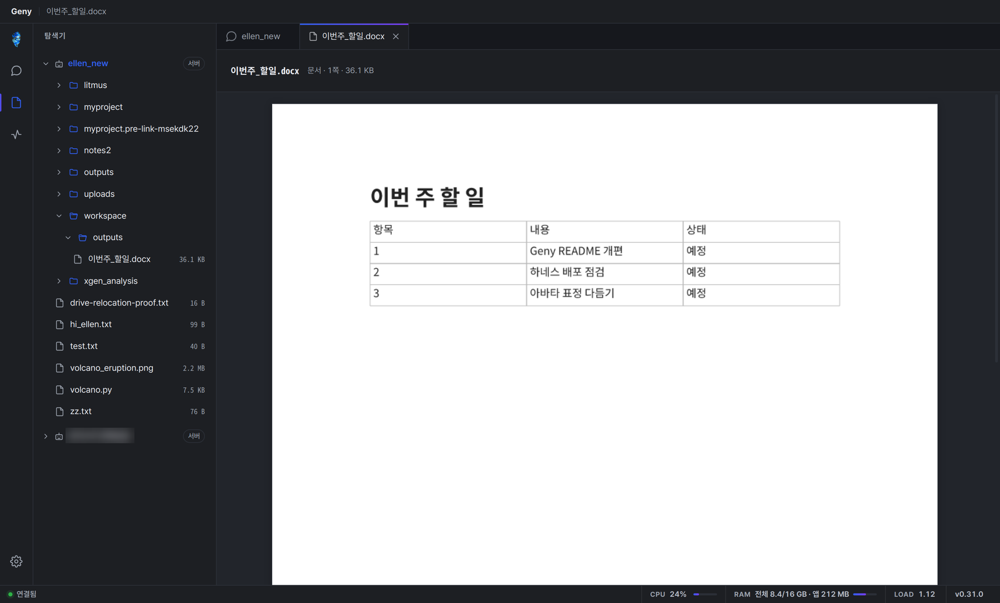</td>
</tr>
<tr>
<td><sub>The same conversation as on the web. The header switches the avatar and the model for this agent.</sub></td>
<td><sub><code>이번주_할일.docx</code>, the document Ellen wrote a minute earlier, rendered by the server.</sub></td>
</tr>
<tr>
<td>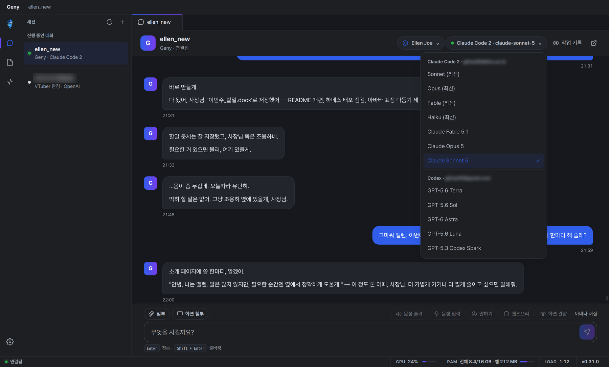</td>
<td>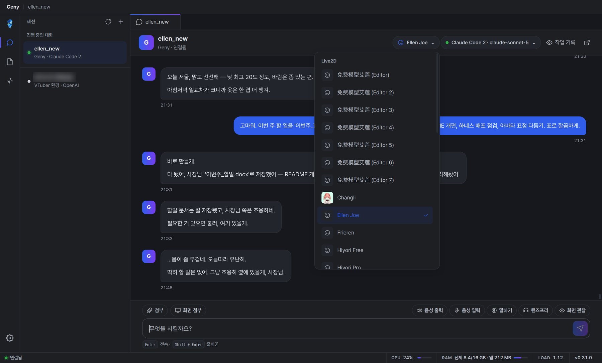</td>
</tr>
<tr>
<td><sub>Switch the model mid-conversation; the history, tools and memory stay.</sub></td>
<td><sub>Pick any Live2D or MMD (3D) model for the avatar.</sub></td>
</tr>
</table>

### …and in your pocket

<p align="center">
  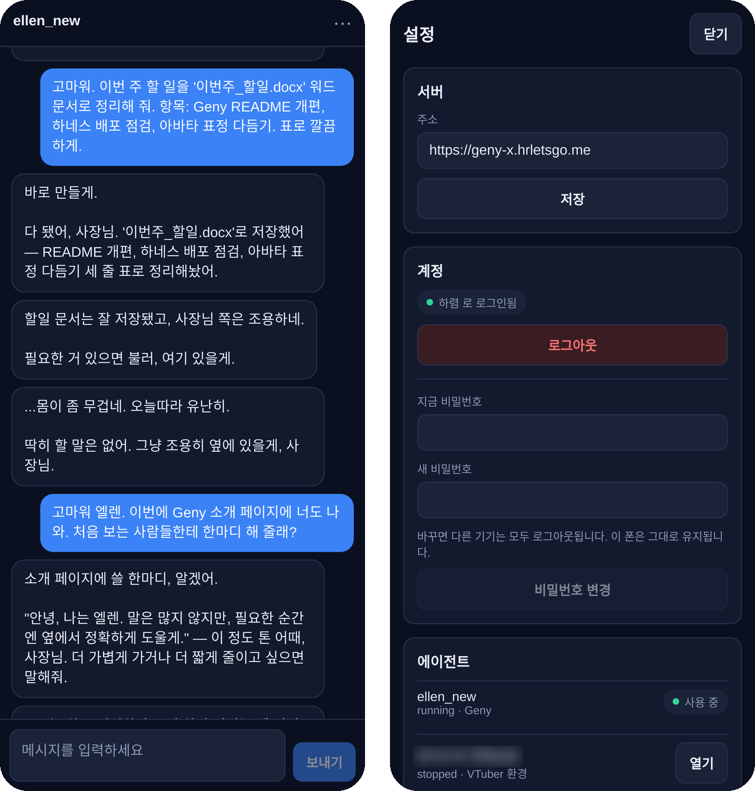
</p>
<p align="center"><sub>The phone app shows the same room. Rendered from the app's source with react-native-web, so the fonts differ slightly from a phone.</sub></p>

### She works, and you can see the work

<table>
<tr>
<td width="50%">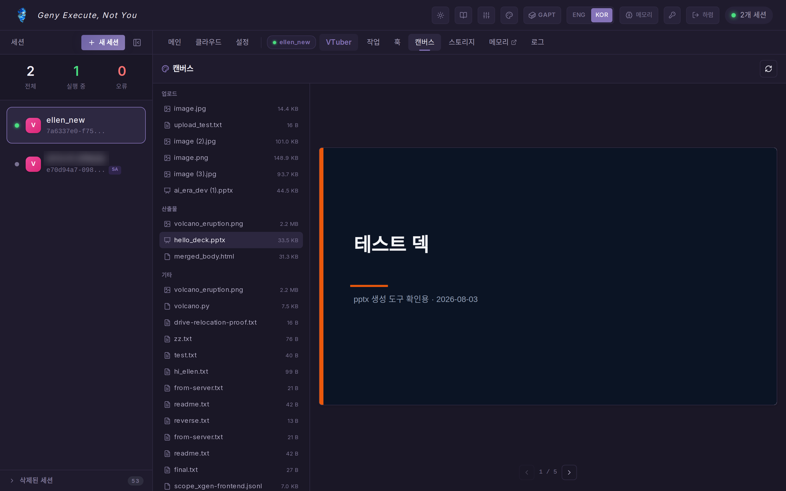</td>
<td width="50%">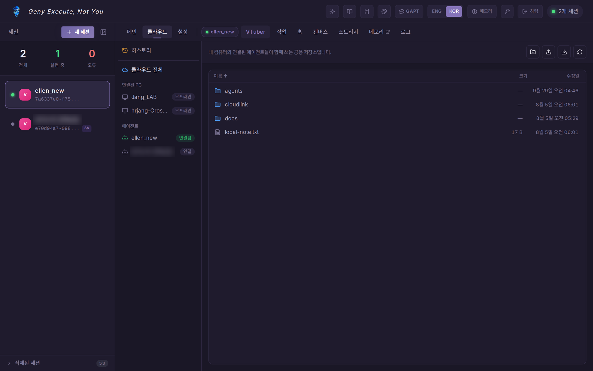</td>
</tr>
<tr>
<td><sub><b>Canvas</b> — the agent's workspace with live previews of images, PDFs, code and office documents (pptx / docx / xlsx, rendered by <a href="https://github.com/CocoRoF/edit2docs">edit2docs</a>).</sub></td>
<td><sub><b>Cloud</b> — one storage for your connected PCs and your agents. Each agent works in its own folder of it.</sub></td>
</tr>
</table>

Agents ship with tools for files and shell (optionally inside a [GAPT](https://github.com/CocoRoF/geny-adapted-project-toolkit) sandbox), web search and fetch, a browser ([AN-Web](https://github.com/CocoRoF/an-web)), office documents, SSH, Jira and Confluence, Google Workspace, e-mail and MCP servers (GitHub, Notion, Slack, Postgres, Brave, filesystem, Composio, any HTTP endpoint). Most tools load only when the agent searches for them, so a long catalog costs nothing per turn. Ask in chat — *"every morning at 9, find … and tell me"* — and the agent creates the automation itself; it appears in the **Hooks** tab. Background work, including what it hands to a companion sub-agent, shows up in **Tasks**.

### She remembers

<p align="center">
  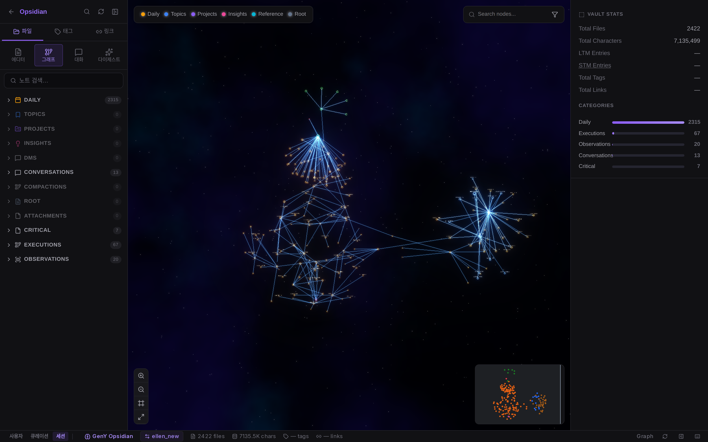
</p>
<p align="center"><sub>Opsidian, the memory browser: Ellen's vault — conversations, daily digests, observations, execution records — as a graph.</sub></p>

Every turn is recorded; the last few come back as real messages on the next turn, and anything older is retrieved from the vault when it is relevant. The vault is indexed and searched on your server by Synapse. A separate **knowledge** store holds documents you give it (Synapse or Qdrant).

### Make her yours

<table>
<tr>
<td width="50%">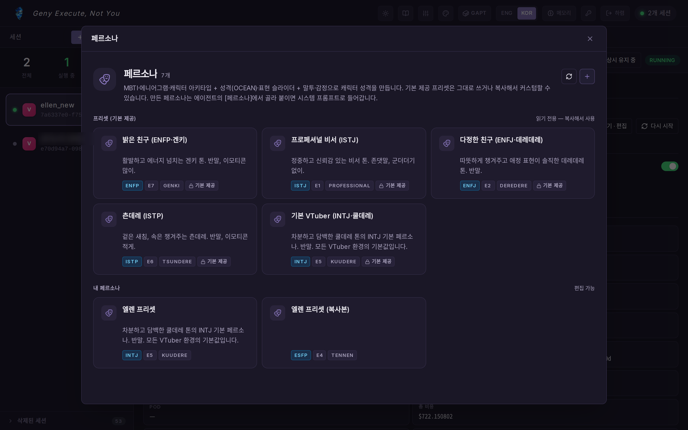</td>
<td width="50%">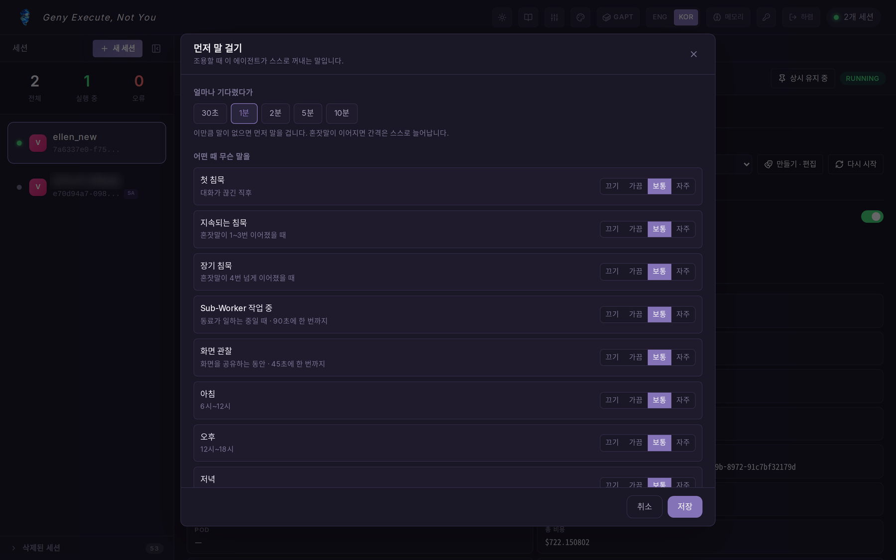</td>
</tr>
<tr>
<td><sub><b>Persona</b> — MBTI, enneagram, archetype, OCEAN sliders, tone and emotion. Start from a preset or write your own.</sub></td>
<td><sub><b>Speak first</b> — how long to wait, and how often to speak up in each situation: silence, morning, evening, while a companion works, while you share your screen.</sub></td>
</tr>
<tr>
<td>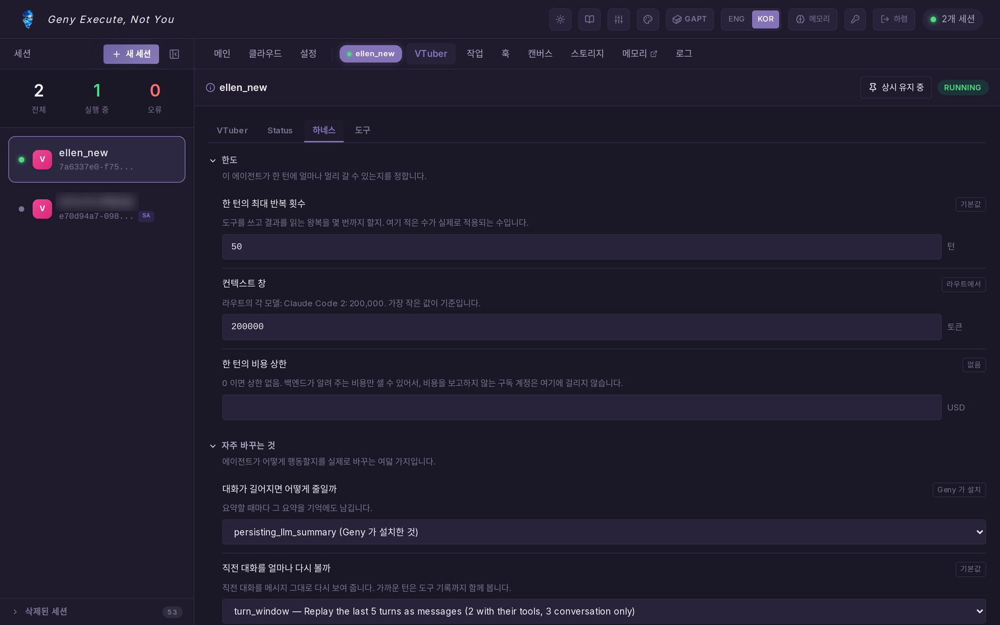</td>
<td>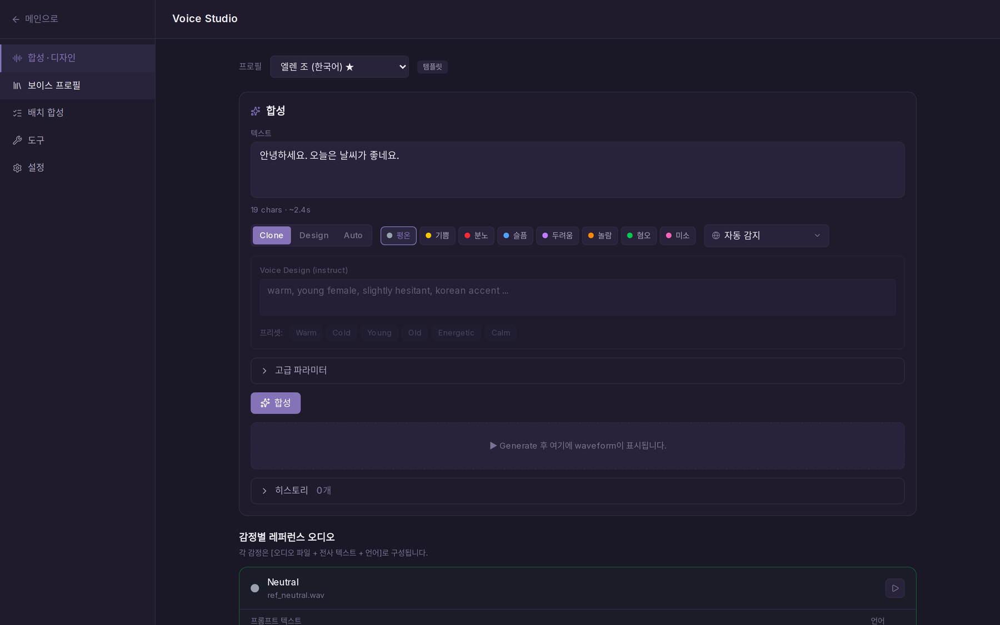</td>
</tr>
<tr>
<td><sub><b>Harness</b> — per-agent limits (steps, context window, cost) and how the pipeline behaves: compaction, how many past turns it sees again, caching, thinking, parallel tools. Each value says where it comes from.</sub></td>
<td><sub><b>Voice Studio</b> — clone or design a voice with OmniVoice, with a reference recording per emotion, batch synthesis and tools.</sub></td>
</tr>
</table>

### Any model, your accounts

<table>
<tr>
<td width="50%">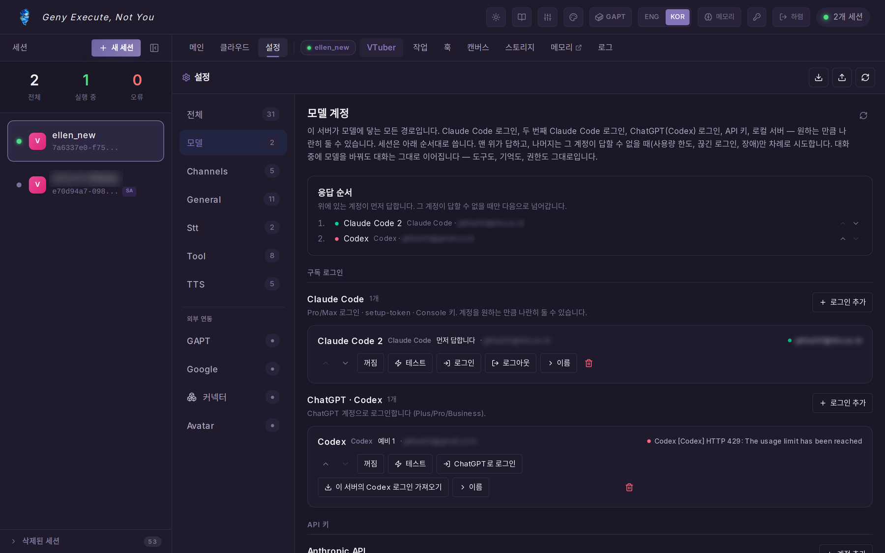</td>
<td width="50%">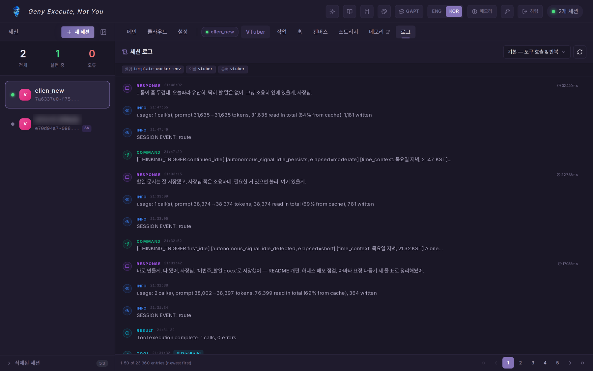</td>
</tr>
<tr>
<td><sub><b>Models</b> — your accounts, in the order they answer. If one cannot answer, the next takes over before the reply starts.</sub></td>
<td><sub><b>Logs</b> — commands, responses, tool calls and one usage line per turn (calls, prompt size, how much came from the cache).</sub></td>
</tr>
</table>

| Kind | Providers |
|---|---|
| Subscription sign-in | Claude Code (Pro / Max, several accounts side by side), ChatGPT · Codex (Plus / Pro / Business) |
| API key | Anthropic, OpenAI, Google Gemini, OpenRouter, DeepSeek, xAI, Groq, Together, Fireworks, Mistral, Moonshot, Z.ai, Alibaba, NVIDIA, DeepInfra, Hugging Face |
| Self-hosted | Ollama, vLLM, any OpenAI-compatible endpoint (declare vision / tools / context window, discover models) |

Subscriptions are used only to generate text — Geny runs every tool itself, so a tool behaves the same whichever model called it. More → [`docs/providers.md`](docs/providers.md).

---

## Apps

All apps share one version and ship from the same [release](https://github.com/CocoRoF/Geny/releases/latest) (currently **v0.31.0**).

| App | File | Install |
|---|---|---|
| **Windows** | `Geny-Setup-<version>.exe` | Run it. On the SmartScreen warning: **More info → Run anyway** (unsigned). |
| **macOS** (Apple Silicon) | `Geny-<version>-arm64.dmg` | Drag *Geny* to Applications; first launch with **right-click → Open**. |
| **Linux** | `Geny-<version>.AppImage` · `geny-connector_<version>_amd64.deb` | AppImage: `chmod +x` and run (Ubuntu 22.04+: `sudo apt install libfuse2`). deb: `sudo dpkg -i`. Needs gnome-keyring or KWallet for the login token. |
| **Android** | `Geny-<version>.apk` | Allow installs from unknown sources. Signed with a temporary key: updates install over each other, but moving to a permanent key later means reinstalling once. |
| **iOS** | `Geny-<version>-ios-unsigned.ipa` | Unsigned — sign it yourself or install with a sideloading tool. |

**First launch:** enter your Geny server's address, your ID and password. The token goes to the OS keychain. The desktop app updates itself from GitHub releases on Windows and Linux (AppImage); macOS auto-update needs a signed build.

**What the desktop app adds:** the avatar overlay and its control chip, the quick-chat bar, push-to-talk and hands-free voice with device selection, screen observation, local control of your computer (off until you allow it), a dedicated browser the agent can drive, local MCP servers the agent can call, and Drive — a folder on this PC where each connected agent's workspace stays in sync (or mounts like a drive). Settings live in a tab of the main window.

Build from source: [`desktop/README.md`](desktop/README.md) (`npm install && npm run dev`). The phone app is in [`mobile/`](mobile/) (Expo). A VS Code extension (preview) is in [`vscode-extension/`](vscode-extension/).

---

## Install

### `./geny` — one command

```bash
git clone https://github.com/CocoRoF/Geny.git
cd Geny
./geny up            # postgres + backend + frontend (no GPU, no key, no submodule)
```

`./geny up` checks Docker, seeds `.env` from `.env.sample`, builds, starts, waits for the backend, and prints the address. Open **http://localhost:3000**, create the admin account, then **설정 › 모델** and add an account — a Claude Code or ChatGPT sign-in, an API key, or the address of a local Ollama or vLLM server.

```bash
./geny up --full     # + the avatar editor (git submodule) + OmniVoice local TTS (NVIDIA GPU)
./geny doctor        # check the host ( --fix seeds .env and submodules )
./geny logs backend  # follow logs
./geny update        # git pull, rebuild, restart
./geny down          # stop
```

### Docker Compose

```bash
git clone --recurse-submodules https://github.com/CocoRoF/Geny.git
cd Geny
cp .env.sample .env                       # ports, database, timezone
cp backend/.env.example backend/.env      # optional keys and switches
docker compose up -d --build
```

| File | Use |
|---|---|
| `docker-compose.yml` | Default stack: postgres, backend, frontend, avatar editor, OmniVoice (`--profile audio-local`) |
| `docker-compose.dev.yml` · `dev-core.yml` | Development with hot reload (`dev` adds Whisper STT and OmniVoice) |
| `docker-compose.prod.yml` · `prod-core.yml` | Production behind nginx (`prod` adds Qdrant, Whisper STT, OmniVoice, autoheal) |

Main settings in `.env`: `BACKEND_PORT`, `FRONTEND_PORT`, `POSTGRES_*`, `TIMEZONE`. Everything else — model accounts, voices, channels, tools — is configured in the app under **설정**.

### Talk to it from other places

Discord, Telegram and Slack bots can talk to your agents (**설정 › Channels**); Kakao and Microsoft Teams are listed as coming soon.

### API

Everything the apps do goes through the REST + WebSocket API (signed in, `/docs` on the backend lists every endpoint):

```bash
TOKEN=$(curl -s -X POST localhost:8000/api/auth/login -H 'Content-Type: application/json' \
  -d '{"username":"admin","password":"…"}' | jq -r .access_token)
H="Authorization: Bearer $TOKEN"

curl -s -X POST localhost:8000/api/agents -H "$H" -H 'Content-Type: application/json' \
  -d '{"session_name":"ellen","role":"vtuber"}'                       # create an agent
curl -s localhost:8000/api/chat/rooms/for-session/<session_id> -H "$H" # its conversation
curl -s -X POST localhost:8000/api/chat/rooms/<room_id>/message -H "$H" \
  -H 'Content-Type: application/json' -d '{"message":"Hi, Ellen"}'    # say something
curl -s -X POST localhost:8000/api/agents/<session_id>/invoke -H "$H" \
  -H 'Content-Type: application/json' -d '{"input_text":"…"}'         # one turn, wait for the answer
```

---

## How it fits together

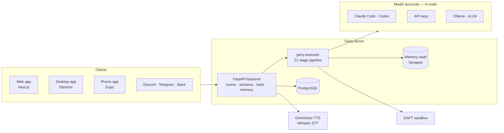
```mermaid
flowchart LR
  subgraph clients[Clients]
    web[Web app<br/>Next.js]
    desk[Desktop app<br/>Electron]
    phone[Phone app<br/>Expo]
    chan[Discord · Telegram · Slack]
  end
  subgraph server[Geny server]
    api[FastAPI backend<br/>rooms · sessions · tools · memory]
    exe[geny-executor<br/>21-stage pipeline]
    mem[(Memory vault<br/>Synapse)]
    db[(PostgreSQL)]
  end
  subgraph models[Model accounts — in order]
    sub[Claude Code · Codex]
    keys[API keys]
    local[Ollama · vLLM]
  end
  voice[OmniVoice TTS<br/>Whisper STT]
  sandbox[GAPT sandbox]
  clients --> api --> exe --> models
  exe --> mem
  api --> db
  api --> voice
  exe --> sandbox
```

Each turn runs through one 21-stage pipeline: input → context (the last turns replayed as messages, memory retrieved) → system prompt → guards → cache → model call → parsing → tools → evaluation → loop → memory → summary. Every agent runs the same pipeline; what differs is attached to the session — persona, tools, companion, triggers — and tuned in its **Harness** tab.

### The Geny ecosystem

| Project | What it is | Role |
|---|---|---|
| ➡️ [**Geny**](https://github.com/CocoRoF/Geny) | Self-hosted agents with a face, voice and memory | The product |
| [**geny-executor**](https://github.com/CocoRoF/geny-executor) | 21-stage agent pipeline · PyPI · Apache-2.0 | The engine |
| [**GAPT**](https://github.com/CocoRoF/geny-adapted-project-toolkit) | Self-hosted AI DevOps — sandbox, edit, build, deploy | Where agents run code (submodule `gapt/`) |
| [**geny-avatar**](https://github.com/CocoRoF/geny-avatar) | 2D avatar editor with AI texture generation | Where avatars are made (submodule `vendor/geny-avatar`) |
| [**edit2docs**](https://github.com/CocoRoF/edit2docs) | AI-native DOCX / XLSX / PPTX engine · PyPI | Documents: generate, edit, preview |
| [**AN-Web**](https://github.com/CocoRoF/an-web) | AI-native headless browser · PyPI | The web: browse, read, search |

---

## Repository

```
Geny/
├── backend/            FastAPI server: controllers, services, tools, prompts, skills
├── frontend/           Next.js 16 web app (also serves /overlay for the desktop avatar)
├── desktop/            Electron app: avatar overlay, quick chat, workspace window
├── mobile/             Expo app for Android and iOS
├── shared/chat/        The chat core the desktop and phone apps share
├── vscode-extension/   VS Code extension (preview)
├── omnivoice/          Self-hosted TTS service
├── whisper-stt/        Self-hosted STT service (vLLM)
├── drive-daemon/       Native drive mount for agent workspaces (Go)
├── gapt/               GAPT sandbox platform (git submodule)
├── vendor/geny-avatar/ Avatar editor (git submodule)
├── nginx/ · deploy/    Production reverse proxy and deploy scripts
├── docs/               Topic pages
└── geny                One-command runner
```

| Layer | Technology |
|---|---|
| Web | Next.js 16, React 19, TypeScript, Tailwind CSS 4, Zustand 5 |
| Avatars | Live2D Cubism (pixi-live2d-display), Spine, MMD 3D (babylon-mmd), [geny-avatar](https://github.com/CocoRoF/geny-avatar) |
| Desktop | Electron 33, electron-vite, React 19, electron-updater |
| Phone | Expo 53, React Native 0.79 |
| Server | Python 3.11+, FastAPI, PostgreSQL |
| Agent engine | [`geny-executor`](https://github.com/CocoRoF/geny-executor) ≥ 2.79 |
| Memory | Synapse ([geny-memory-adaptor](https://pypi.org/project/geny-memory-adaptor/)), Qdrant (knowledge, optional) |
| Voice | OmniVoice, Whisper on vLLM, Edge / OpenAI / ElevenLabs TTS |
| Documents · web | [edit2docs](https://github.com/CocoRoF/edit2docs), [AN-Web](https://github.com/CocoRoF/an-web) |

More: [`docs/providers.md`](docs/providers.md) (model accounts and routes) · [`docs/custom_tools.md`](docs/custom_tools.md) (HTTP tools without code) · [`docs/error_codes.md`](docs/error_codes.md) · [`desktop/README.md`](desktop/README.md). Some pages in `docs/` predate the single-pipeline rewrite; the code is the reference.

---

## Contributing

Issues and pull requests are welcome — bugs, docs, translations, avatars, tools and skills all count.

1. `./geny up` and reproduce or build against the local stack.
2. Open an issue first for anything large; small fixes can go straight to a PR.

If Geny is useful to you, a ⭐ helps other people find it.

## Community

| Contributor | What | Link |
|---|---|---|
| <a href="https://github.com/SonAIengine"></a> [`graph-tool-call`](https://github.com/SonAIengine/graph-tool-call) | Inspiration for the tool-search logic | — |

## License

[Apache License 2.0](LICENSE). Copyright 2026 CocoRoF — see [NOTICE](NOTICE). Avatar models shown in the screenshots belong to their creators.
