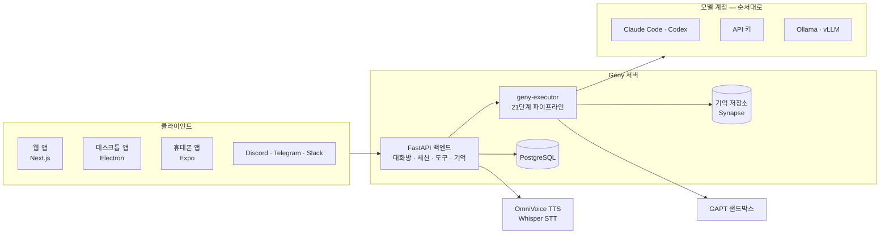

<p align="center">
  
</p>

<h1 align="center">Geny — <em>Geny Execute, Not You</em></h1>

<p align="center">
얼굴과 목소리와 기억을 가진 AI 에이전트를 내 서버에서.<br/>
일을 하고, 한 일을 기억하고, 할 말이 있으면 먼저 말을 거는 에이전트.
</p>

<p align="center">
<a href="README.md">English</a> ·
<a href="#빠른-시작">빠른 시작</a> ·
<a href="#엘렌과-둘러보기">둘러보기</a> ·
<a href="#앱">앱</a> ·
<a href="#설치">설치</a> ·
<a href="docs/providers.md">모델 계정</a>
</p>

<p align="center">
  <a href="LICENSE"></a>
  <a href="https://github.com/CocoRoF/Geny/releases/latest"></a>
  <a href="https://pypi.org/project/geny-executor/"></a>
  
  
  <a href="https://github.com/CocoRoF/Geny/stargazers"></a>
</p>

<p align="center">
  
</p>
<p align="center"><sub>웹 앱의 엘렌(<code>ellen_new</code>). 날씨를 찾아보고, 워드 문서를 만들고, 자기소개를 했습니다.<br/><em>"안녕, 나는 엘렌. 말은 많지 않지만, 필요한 순간엔 옆에서 정확하게 도울게."</em></sub></p>

---

## Geny 는

Geny 서버 하나를 띄우면, 그 위에 내 에이전트들이 삽니다. 에이전트 하나는 끝나지 않는 대화 하나이고, 저마다 페르소나·아바타·목소리·기억·작업공간을 가집니다. 대답만 하지 않습니다. 도구를 부르고, 파일과 오피스 문서를 만들고, 웹을 찾아보고, 샌드박스에서 코드를 돌리고, 스스로 자동화를 걸어 두고, 할 말이 생기면 먼저 말을 겁니다.

같은 에이전트를 세 곳에서 만납니다. **웹 앱**, 아바타가 화면 위에 사는 **데스크톱 앱**, 그리고 **휴대폰**. 어디서 열어도 같은 대화입니다. 답하는 모델은 내가 고릅니다. **Claude Code** 나 **ChatGPT(Codex)** 구독으로 로그인하거나, 16곳 중 아무 곳의 API 키를 넣거나, 내 **Ollama / vLLM** 서버 주소를 적으면 되고, 대화 도중에도 바꿀 수 있습니다.

모든 것은 PyPI 에 공개된 21단계 에이전트 파이프라인 [`geny-executor`](https://github.com/CocoRoF/geny-executor) 위에서 돕니다. LangChain 도 LangGraph 도 쓰지 않습니다.

## 빠른 시작

```bash
git clone https://github.com/CocoRoF/Geny.git && cd Geny && ./geny up
# → http://localhost:3000 을 열고 관리자 계정을 만든 다음
#   설정 › 모델 → 계정 추가
```

시작할 때 GPU 도 API 키도 필요 없습니다. 로컬 Ollama 로도 되고, 음성은 클라우드 edge-tts 로 대신합니다. 자세한 건 [설치](#설치)에.

---

## 엘렌과 둘러보기

아래 화면은 모두 실제 화면입니다. Geny 운영 서버, 에이전트 `ellen_new`, 그리고 위의 그 대화. 웹과 휴대폰은 Playwright 로, 데스크톱은 앱에 들어 있는 스크린샷 도구로 찍었습니다. 계정 이메일과 다른 비공개 에이전트의 이름은 흐리게 가렸습니다.

### 바탕화면에 산다

<p align="center">
  
</p>
<p align="center"><sub>데스크톱 앱의 세 창(아바타 오버레이, 빠른 대화 창 <kbd>Ctrl/Cmd</kbd>+<kbd>Shift</kbd>+<kbd>Enter</kbd>, 메인 창)을 실제로 찍어 배경화면 위에 합성했습니다.</sub></p>

**데스크톱 앱**은 아바타를 화면 위에 올려 둡니다. 투명하고, 늘 위에 있고, 아바타를 건드리는 곳이 아니면 클릭이 그대로 뒤로 지나갑니다. 빠른 대화 창으로, 눌러서 말하기(<kbd>Ctrl/Cmd</kbd>+<kbd>Shift</kbd>+<kbd>Space</kbd>)로, 핸즈프리로 말을 걸고, 화면을 보여 주고, 내가 고른 마이크와 스피커로 듣고 말하게 할 수 있습니다. 메인 창은 작업 공간입니다. 모든 에이전트의 파일이 탐색기 하나에 있고, 문서는 그 자리에서 열리고, 대화가 그 옆에 있습니다.

<table>
<tr>
<td width="50%"></td>
<td width="50%"></td>
</tr>
<tr>
<td><sub>웹과 같은 대화입니다. 머리글에서 이 에이전트의 아바타와 모델을 바꿉니다.</sub></td>
<td><sub>엘렌이 방금 만든 <code>이번주_할일.docx</code>. 서버가 그려서 보여 줍니다.</sub></td>
</tr>
<tr>
<td></td>
<td></td>
</tr>
<tr>
<td><sub>대화 도중에 모델을 바꿔도 대화 기록·도구·기억은 그대로입니다.</sub></td>
<td><sub>아바타는 Live2D 나 MMD(3D) 모델 중에서 고릅니다.</sub></td>
</tr>
</table>

### 주머니 속에도

<p align="center">
  
</p>
<p align="center"><sub>휴대폰 앱에서도 같은 대화방이 열립니다. 앱 소스를 react-native-web 으로 띄워 찍었기 때문에 실제 폰과 글꼴이 조금 다릅니다.</sub></p>

### 일을 하고, 한 일이 보인다

<table>
<tr>
<td width="50%"></td>
<td width="50%"></td>
</tr>
<tr>
<td><sub><b>캔버스</b>: 에이전트의 작업공간을 그대로 미리 봅니다. 이미지, PDF, 코드, 오피스 문서(pptx / docx / xlsx, <a href="https://github.com/CocoRoF/edit2docs">edit2docs</a> 가 그림).</sub></td>
<td><sub><b>클라우드</b>: 연결한 PC 와 에이전트가 함께 쓰는 저장소 하나. 에이전트는 각자 그 안의 자기 폴더에서 일합니다.</sub></td>
</tr>
</table>

에이전트에게는 처음부터 도구가 있습니다. 파일과 셸([GAPT](https://github.com/CocoRoF/geny-adapted-project-toolkit) 샌드박스 안에서도), 웹 검색과 가져오기, 브라우저([AN-Web](https://github.com/CocoRoF/an-web)), 오피스 문서, SSH, Jira·Confluence, Google Workspace, 이메일, 그리고 MCP 서버(GitHub, Notion, Slack, Postgres, Brave, filesystem, Composio, 임의의 HTTP 엔드포인트). 대부분의 도구는 에이전트가 찾을 때만 불러오므로, 목록이 길어도 매 턴 비용이 늘지 않습니다. 대화에서 *"매일 아침 9시에 … 찾아서 알려 줘"* 라고 하면 에이전트가 직접 자동화를 만들고, **훅** 탭에 나타납니다. 동료 하위 에이전트에게 맡긴 일을 포함해 뒤에서 도는 작업은 **작업** 탭에 보입니다.

### 기억한다

<p align="center">
  
</p>
<p align="center"><sub>기억 브라우저 Opsidian. 엘렌의 저장소(대화, 하루 요약, 관찰, 실행 기록)를 그래프로 봅니다.</sub></p>

모든 턴이 기록됩니다. 최근 몇 턴은 다음 턴에 실제 메시지로 다시 들어가고, 그보다 오래된 것은 관련이 있을 때 저장소에서 찾아옵니다. 저장소의 색인과 검색은 내 서버에서 Synapse 가 맡습니다. 내가 건넨 문서는 따로 **지식** 저장소(Synapse 또는 Qdrant)에 둡니다.

### 내 에이전트로 만들기

<table>
<tr>
<td width="50%"></td>
<td width="50%"></td>
</tr>
<tr>
<td><sub><b>페르소나</b>: MBTI, 에니어그램, 캐릭터 아키타입, 성격(OCEAN)·표현 슬라이더, 말투와 감정. 프리셋에서 시작하거나 직접 만듭니다.</sub></td>
<td><sub><b>먼저 말 걸기</b>: 얼마나 기다렸다가, 어떤 상황에서 얼마나 자주 말을 꺼낼지. 침묵, 아침·저녁, 동료가 일하는 중, 화면을 공유하는 중.</sub></td>
</tr>
<tr>
<td></td>
<td></td>
</tr>
<tr>
<td><sub><b>하네스</b>: 에이전트별 한도(반복 횟수, 컨텍스트 창, 비용)와 파이프라인의 동작. 대화가 길어지면 줄이는 법, 직전 대화를 얼마나 다시 볼지, 캐시, 생각, 도구 동시 실행. 값마다 어디서 왔는지 표시됩니다.</sub></td>
<td><sub><b>Voice Studio</b>: OmniVoice 로 목소리를 복제하거나 디자인합니다. 감정별 레퍼런스 녹음, 배치 합성, 도구.</sub></td>
</tr>
</table>

### 어떤 모델이든, 내 계정으로

<table>
<tr>
<td width="50%"></td>
<td width="50%"></td>
</tr>
<tr>
<td><sub><b>모델</b>: 내 계정들을 답하는 순서대로. 위 계정이 답할 수 없으면 답이 시작되기 전에 다음 계정이 이어받습니다.</sub></td>
<td><sub><b>로그</b>: 명령, 응답, 도구 호출, 그리고 턴마다 한 줄의 사용량(호출 수, 프롬프트 크기, 캐시에서 읽은 비율).</sub></td>
</tr>
</table>

| 종류 | 제공자 |
|---|---|
| 구독 로그인 | Claude Code (Pro / Max, 여러 계정을 나란히), ChatGPT · Codex (Plus / Pro / Business) |
| API 키 | Anthropic, OpenAI, Google Gemini, OpenRouter, DeepSeek, xAI, Groq, Together, Fireworks, Mistral, Moonshot, Z.ai, Alibaba, NVIDIA, DeepInfra, Hugging Face |
| 직접 운영 | Ollama, vLLM, OpenAI 호환 엔드포인트 (비전·도구·컨텍스트 창 지정, 모델 목록 조회) |

구독 계정은 글을 만드는 데만 씁니다. 도구는 전부 Geny 가 직접 돌리므로, 어느 모델이 불러도 도구는 똑같이 동작합니다. 자세히 → [`docs/providers.md`](docs/providers.md)

---

## 앱

모든 앱은 한 버전을 쓰고 같은 [릴리스](https://github.com/CocoRoF/Geny/releases/latest)에서 나옵니다 (현재 **v0.31.0**).

| 앱 | 파일 | 설치 |
|---|---|---|
| **Windows** | `Geny-Setup-<버전>.exe` | 실행합니다. SmartScreen 이 뜨면 **추가 정보 → 실행** (서명 없음). |
| **macOS** (Apple Silicon) | `Geny-<버전>-arm64.dmg` | *Geny* 를 응용 프로그램으로 끌어 놓고, 처음엔 **오른쪽 클릭 → 열기**. |
| **Linux** | `Geny-<버전>.AppImage` · `geny-connector_<버전>_amd64.deb` | AppImage: `chmod +x` 후 실행 (Ubuntu 22.04+ 는 `sudo apt install libfuse2`). deb: `sudo dpkg -i`. 로그인 토큰 보관에 gnome-keyring 이나 KWallet 이 필요합니다. |
| **Android** | `Geny-<버전>.apk` | 출처를 알 수 없는 앱 설치를 허용합니다. 임시 키로 서명돼 있어 릴리스끼리는 그대로 업데이트되지만, 나중에 정식 키로 바뀌면 한 번은 지우고 다시 깔아야 합니다. |
| **iOS** | `Geny-<버전>-ios-unsigned.ipa` | 서명되지 않았습니다. 직접 서명하거나 사이드로딩 도구로 설치하세요. |

**처음 실행:** Geny 서버 주소, 아이디, 비밀번호를 넣습니다. 토큰은 OS 키체인에 들어갑니다. 데스크톱 앱은 Windows 와 Linux(AppImage)에서 GitHub 릴리스로 스스로 업데이트합니다. macOS 자동 업데이트에는 정식 서명 빌드가 필요합니다.

**데스크톱 앱에만 있는 것:** 아바타 오버레이와 조작 칩, 빠른 대화 창, 장치를 고를 수 있는 눌러서 말하기·핸즈프리 음성, 화면 관찰, 내 컴퓨터 조작(허락하기 전엔 꺼져 있음), 에이전트가 다루는 전용 브라우저, 에이전트가 부를 수 있는 로컬 MCP 서버, 그리고 드라이브(연결한 에이전트마다 작업공간이 이 PC 의 폴더와 실시간으로 동기화되거나 드라이브처럼 연결됨). 설정은 메인 창의 탭 하나에 있습니다.

소스에서 빌드: [`desktop/README.md`](desktop/README.md) (`npm install && npm run dev`). 휴대폰 앱은 [`mobile/`](mobile/) (Expo). VS Code 확장(미리보기)은 [`vscode-extension/`](vscode-extension/).

---

## 설치

### `./geny` 한 줄

```bash
git clone https://github.com/CocoRoF/Geny.git
cd Geny
./geny up            # postgres + backend + frontend (GPU·키·서브모듈 없이)
```

`./geny up` 은 Docker 를 확인하고, `.env.sample` 로 `.env` 를 만들고, 빌드하고, 띄우고, 백엔드가 준비될 때까지 기다린 뒤 주소를 알려 줍니다. **http://localhost:3000** 을 열어 관리자 계정을 만들고, **설정 › 모델** 에서 계정을 추가하세요. Claude Code 나 ChatGPT 로그인, API 키, 또는 로컬 Ollama·vLLM 서버 주소면 됩니다.

```bash
./geny up --full     # + 아바타 편집기(git 서브모듈) + OmniVoice 로컬 TTS (NVIDIA GPU)
./geny doctor        # 호스트 점검 ( --fix 는 .env 와 서브모듈을 채움 )
./geny logs backend  # 로그 보기
./geny update        # git pull, 다시 빌드, 재시작
./geny down          # 중지
```

### Docker Compose

```bash
git clone --recurse-submodules https://github.com/CocoRoF/Geny.git
cd Geny
cp .env.sample .env                       # 포트, 데이터베이스, 시간대
cp backend/.env.example backend/.env      # 선택: 키와 스위치
docker compose up -d --build
```

| 파일 | 용도 |
|---|---|
| `docker-compose.yml` | 기본 스택: postgres, backend, frontend, 아바타 편집기, OmniVoice (`--profile audio-local`) |
| `docker-compose.dev.yml` · `dev-core.yml` | 핫 리로드 개발용 (`dev` 는 Whisper STT 와 OmniVoice 추가) |
| `docker-compose.prod.yml` · `prod-core.yml` | nginx 뒤 운영용 (`prod` 는 Qdrant, Whisper STT, OmniVoice, autoheal 추가) |

`.env` 의 주요 값: `BACKEND_PORT`, `FRONTEND_PORT`, `POSTGRES_*`, `TIMEZONE`. 나머지(모델 계정, 목소리, 채널, 도구)는 앱의 **설정** 에서 정합니다.

### 다른 곳에서 말 걸기

Discord, Telegram, Slack 봇으로도 에이전트와 대화할 수 있습니다(**설정 › Channels**). 카카오와 Microsoft Teams 는 준비 중으로 표시돼 있습니다.

### API

앱이 하는 일은 모두 REST + WebSocket API 를 거칩니다 (로그인한 상태에서 백엔드의 `/docs` 에 전체 목록이 있습니다).

```bash
TOKEN=$(curl -s -X POST localhost:8000/api/auth/login -H 'Content-Type: application/json' \
  -d '{"username":"admin","password":"…"}' | jq -r .access_token)
H="Authorization: Bearer $TOKEN"

curl -s -X POST localhost:8000/api/agents -H "$H" -H 'Content-Type: application/json' \
  -d '{"session_name":"ellen","role":"vtuber"}'                       # 에이전트 만들기
curl -s localhost:8000/api/chat/rooms/for-session/<session_id> -H "$H" # 그 에이전트의 대화방
curl -s -X POST localhost:8000/api/chat/rooms/<room_id>/message -H "$H" \
  -H 'Content-Type: application/json' -d '{"message":"안녕, 엘렌"}'   # 말 걸기
curl -s -X POST localhost:8000/api/agents/<session_id>/invoke -H "$H" \
  -H 'Content-Type: application/json' -d '{"input_text":"…"}'         # 한 턴 돌리고 답 받기
```

---

## 구조



턴 하나는 21단계 파이프라인 하나를 지납니다. 입력 → 컨텍스트(최근 턴을 메시지로 다시 넣고 기억을 찾아옴) → 시스템 프롬프트 → 가드 → 캐시 → 모델 호출 → 해석 → 도구 → 평가 → 반복 → 기억 → 요약. 모든 에이전트가 같은 파이프라인을 씁니다. 다른 것은 세션에 붙어 있는 것들(페르소나, 도구, 동료, 트리거)이고, 세부 동작은 세션의 **하네스** 탭에서 조정합니다.

### Geny 생태계

| 프로젝트 | 무엇인가 | 역할 |
|---|---|---|
| ➡️ [**Geny**](https://github.com/CocoRoF/Geny) | 얼굴·목소리·기억을 가진 자체 호스팅 에이전트 | 제품 |
| [**geny-executor**](https://github.com/CocoRoF/geny-executor) | 21단계 에이전트 파이프라인 · PyPI · Apache-2.0 | 엔진 |
| [**GAPT**](https://github.com/CocoRoF/geny-adapted-project-toolkit) | 자체 호스팅 AI DevOps: 샌드박스, 편집, 빌드, 배포 | 에이전트가 코드를 돌리는 곳 (서브모듈 `gapt/`) |
| [**geny-avatar**](https://github.com/CocoRoF/geny-avatar) | AI 텍스처 생성이 들어간 2D 아바타 편집기 | 아바타를 만드는 곳 (서브모듈 `vendor/geny-avatar`) |
| [**edit2docs**](https://github.com/CocoRoF/edit2docs) | AI 네이티브 DOCX / XLSX / PPTX 엔진 · PyPI | 문서: 생성, 편집, 미리보기 |
| [**AN-Web**](https://github.com/CocoRoF/an-web) | AI 네이티브 헤드리스 브라우저 · PyPI | 웹: 탐색, 읽기, 검색 |

---

## 저장소

```
Geny/
├── backend/            FastAPI 서버: 컨트롤러, 서비스, 도구, 프롬프트, 스킬
├── frontend/           Next.js 16 웹 앱 (데스크톱 아바타용 /overlay 도 여기서)
├── desktop/            Electron 앱: 아바타 오버레이, 빠른 대화, 작업 창
├── mobile/             Android·iOS 용 Expo 앱
├── shared/chat/        데스크톱과 휴대폰 앱이 함께 쓰는 채팅 코어
├── vscode-extension/   VS Code 확장 (미리보기)
├── omnivoice/          자체 호스팅 TTS 서비스
├── whisper-stt/        자체 호스팅 STT 서비스 (vLLM)
├── drive-daemon/       에이전트 작업공간용 드라이브 마운트 (Go)
├── gapt/               GAPT 샌드박스 플랫폼 (git 서브모듈)
├── vendor/geny-avatar/ 아바타 편집기 (git 서브모듈)
├── nginx/ · deploy/    운영용 리버스 프록시와 배포 스크립트
├── docs/               주제별 문서
└── geny                한 줄 실행기
```

| 층 | 기술 |
|---|---|
| 웹 | Next.js 16, React 19, TypeScript, Tailwind CSS 4, Zustand 5 |
| 아바타 | Live2D Cubism (pixi-live2d-display), Spine, MMD 3D (babylon-mmd), [geny-avatar](https://github.com/CocoRoF/geny-avatar) |
| 데스크톱 | Electron 33, electron-vite, React 19, electron-updater |
| 휴대폰 | Expo 53, React Native 0.79 |
| 서버 | Python 3.11+, FastAPI, PostgreSQL |
| 에이전트 엔진 | [`geny-executor`](https://github.com/CocoRoF/geny-executor) ≥ 2.79 |
| 기억 | Synapse ([geny-memory-adaptor](https://pypi.org/project/geny-memory-adaptor/)), Qdrant (지식, 선택) |
| 음성 | OmniVoice, vLLM 위의 Whisper, Edge / OpenAI / ElevenLabs TTS |
| 문서 · 웹 | [edit2docs](https://github.com/CocoRoF/edit2docs), [AN-Web](https://github.com/CocoRoF/an-web) |

더 보기: [`docs/providers.md`](docs/providers.md) (모델 계정과 라우트) · [`docs/custom_tools.md`](docs/custom_tools.md) (코드 없이 HTTP 도구) · [`docs/error_codes.md`](docs/error_codes.md) · [`desktop/README.md`](desktop/README.md). `docs/` 의 일부 문서는 단일 파이프라인 개편 이전 내용이라, 기준은 코드입니다.

---

## 기여

이슈와 PR 을 환영합니다. 버그, 문서, 번역, 아바타, 도구와 스킬 모두 기여입니다.

1. `./geny up` 으로 로컬 스택을 띄워 재현하거나 그 위에서 만듭니다.
2. 큰 작업은 이슈부터, 작은 수정은 바로 PR 로.

Geny 가 쓸모 있었다면 ⭐ 하나가 다른 사람이 Geny 를 찾는 데 도움이 됩니다.

## 커뮤니티

| 기여자 | 내용 | 링크 |
|---|---|---|
| <a href="https://github.com/SonAIengine"></a> [`graph-tool-call`](https://github.com/SonAIengine/graph-tool-call) | 도구 검색 로직의 영감 | — |

## 라이선스

[Apache License 2.0](LICENSE). Copyright 2026 CocoRoF — [NOTICE](NOTICE) 참고. 스크린샷 속 아바타 모델의 권리는 각 제작자에게 있습니다.
